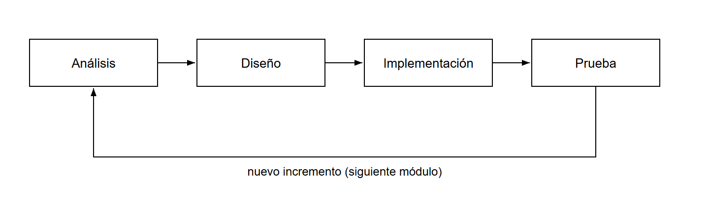

# 4. METODOLOGÍA

En este capítulo se describe la forma en que se ha organizado el desarrollo del proyecto:
la metodología de trabajo empleada y su justificación, las herramientas y el entorno
utilizados, la organización del trabajo por iteraciones y, por último, los principales
problemas encontrados durante el desarrollo y cómo se resolvieron.

## 4.1. Metodología de desarrollo

El proyecto se ha desarrollado siguiendo un enfoque **iterativo e incremental**. En lugar
de intentar construir la aplicación completa de una sola vez, se partió de un **núcleo
mínimo funcional** y, sobre él, se fueron **añadiendo y refinando módulos** de forma
sucesiva: cada nueva funcionalidad se integraba en una versión ya operativa, se probaba y
servía de base para la siguiente.

Esta elección responde a las características del proyecto. Al tratarse de un trabajo
realizado por **una sola persona** y cuyo alcance se fue **concretando y ampliando** a
medida que avanzaba —añadiendo prestaciones a cada apartado según se identificaban nuevas
necesidades—, un modelo rígido y secuencial habría resultado poco adecuado. Un modelo en
cascada exige tener todos los requisitos cerrados desde el inicio; aquí, en cambio, la
posibilidad de disponer pronto de una versión utilizable y de **incorporar mejoras de forma
progresiva** encajaba mucho mejor con la realidad del desarrollo. Cada incremento siguió
internamente el mismo ciclo —análisis, diseño, implementación y prueba— aplicado a un
alcance acotado, tal como muestra la Figura 4.1.

**Figura 4.1.** Ciclo de desarrollo iterativo e incremental aplicado a cada módulo.
_Fuente: elaboración propia._

## 4.2. Herramientas y entorno de trabajo

El desarrollo se apoyó en las siguientes herramientas:

- **Editor de código.** Se utilizó Visual Studio Code como entorno de desarrollo, por su
  integración con el control de versiones y su soporte para JavaScript/TypeScript.
- **Control de versiones.** El proyecto se gestionó con Git y un repositorio remoto, lo que
  permitió mantener un historial de cambios y recuperar versiones anteriores.
- **Base de datos.** Se ejecutó PostgreSQL en un contenedor mediante Docker, lo que
  simplifica la puesta en marcha del entorno local y su reproducibilidad. Para inspeccionar
  y editar los datos durante el desarrollo se empleó la herramienta visual del ORM.
- **Pruebas e integración continua.** Durante el desarrollo se verificaron manualmente los
  flujos de cada módulo y se escribió un conjunto de **pruebas automatizadas** en el
  backend. Además, se configuró un proceso de **integración continua** que, ante cada
  cambio, valida la compilación, el estilo y las pruebas, evitando que se introduzcan
  regresiones (capítulo 9).

## 4.3. Organización del trabajo por iteraciones

El trabajo se organizó en iteraciones sucesivas, cada una centrada en un conjunto coherente
de funcionalidades. De forma resumida:

1. **Núcleo.** Autenticación de usuarios (registro, inicio y cierre de sesión) y gestión de
   invitados, que constituyen la base sobre la que se apoya el resto del sistema.
2. **Módulos de organización.** Grupos, mesas y asignación de asientos, tareas y agenda.
3. **Módulos económicos y de seguimiento.** Presupuesto, proveedores y el panel de
   seguimiento que agrega el estado de la boda.
4. **Funcionalidades avanzadas y endurecimiento.** Envío de invitaciones y confirmación
   pública de asistencia, asistencias con inteligencia artificial, y las mejoras
   transversales de seguridad, pruebas y calidad.

Dentro de cada iteración, la implementación de un módulo seguía un orden natural derivado
de la arquitectura: primero se definía su representación en el **modelo de datos**, después
la lógica del **servidor** (servicio, validación y ruta) y, por último, la **interfaz** que
lo consume, cerrando con una prueba manual del flujo completo.

## 4.4. Problemas encontrados durante el desarrollo

Como en cualquier proyecto de software, durante el desarrollo surgieron dificultades que
obligaron a replantear soluciones. Se destacan cuatro por su relevancia.

### 4.4.1. La representación visual de las mesas

Uno de los aspectos que más iteración requirió no fue la lógica de datos, sino **cómo
presentar las mesas de forma visual y comprensible**. La asignación de invitados a asientos
es intuitiva sobre el papel, pero trasladarla a una interfaz clara —que mostrara las mesas,
sus asientos libres y ocupados, y permitiera asignar a una persona a un sitio concreto— no
era evidente. Se probaron distintas formas de disposición hasta llegar a un **mapa de
mesas** en el que cada mesa muestra sus asientos y el usuario coloca al invitado
seleccionado en el asiento deseado, con acciones para liberar un asiento o vaciar una mesa.

### 4.4.2. El aislamiento entre bodas

Al permitir que un usuario gestione varias bodas y que existan varios usuarios, se hizo
evidente la necesidad de **impedir que nadie accediera a datos de una boda que no es suya**.
Un primer enfoque, en el que cada consulta se limitaba a la boda indicada por el cliente,
resultaba insuficiente: manipulando el identificador de un recurso se podía intentar acceder
a datos ajenos. La solución consistió en establecer una **doble barrera de autorización**:
un control previo que comprueba que la boda pertenece al usuario y, además, la restricción de
todas las consultas por propietario. Esta decisión, descrita en el capítulo 7, se convirtió
en un principio transversal del sistema.

### 4.4.3. La expiración de la sesión

La autenticación basada en un único *token* de vida corta presentaba un inconveniente de
usabilidad: cuando el *token* caducaba, el usuario era **expulsado al inicio de sesión** en
mitad de su trabajo. Resolverlo obligó a introducir un segundo *token* de larga duración con
el que **renovar la sesión de forma transparente**, y a llevar un registro de las sesiones
activas para poder invalidarlas de verdad al cerrar sesión. El resultado es que la sesión se
mantiene con naturalidad mientras es legítima, sin sacrificar la seguridad.

### 4.4.4. La codificación y el separador en la importación CSV

La importación de invitados desde un fichero CSV reveló un problema al abrir dichos ficheros
en la versión española de Excel: **los acentos y la «ñ» se corrompían y las columnas no se
separaban correctamente**. La causa estaba en la codificación y en el separador de columnas
que Excel asume según la configuración regional. La solución —anteponer la marca de
codificación UTF-8 y usar el punto y coma como separador— permitió que los ficheros
generados por la aplicación se abrieran correctamente sin que el usuario tuviera que ajustar
nada, un detalle pequeño pero importante para la experiencia de uso.

Estos problemas, y otros de menor entidad, se tradujeron en aprendizajes que se recogen en
las conclusiones (capítulo 11).
