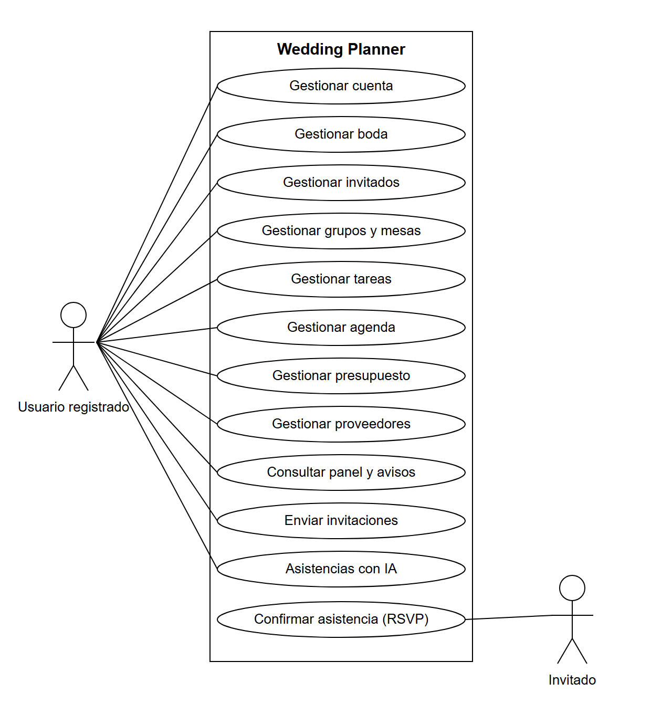

# 6. ANÁLISIS

En este capítulo se especifica el comportamiento esperado de la aplicación antes de
entrar en su diseño e implementación. Se parte de los objetivos definidos en el
capítulo 3 y se traducen en un catálogo de **requisitos funcionales** (qué debe permitir
hacer el sistema) y **requisitos no funcionales** (cómo debe hacerlo: seguridad,
usabilidad, rendimiento o calidad). A continuación se identifican los **actores** que
interactúan con la aplicación y se describen los **casos de uso** más representativos.
El capítulo se cierra con una **matriz de trazabilidad** que relaciona cada requisito con
los casos de uso que lo ejercitan y con su estado de implementación, de modo que la
cobertura del sistema pueda comprobarse de forma objetiva.

Los requisitos se han capturado de forma **incremental**: se partió de un núcleo mínimo
—autenticación y gestión de invitados— y, a medida que la aplicación crecía, se fueron
incorporando y refinando los requisitos de cada nuevo módulo (mesas, tareas, agenda,
presupuesto, proveedores) hasta completar el producto. Cada requisito se identifica con
un código de la forma `RF-nn` (funcional), `RNF-nn` (no funcional) o `IA-nn` (funcional
específico de las asistencias con inteligencia artificial), agrupados por dominio. Esta
codificación se utiliza como referencia única en el resto de la memoria.

## 6.1. Requisitos funcionales

Los requisitos funcionales describen los servicios que la aplicación ofrece a sus
usuarios. Se presentan agrupados por módulo. La columna **Prioridad** distingue entre
requisitos imprescindibles para un producto mínimo viable (**Alta**), deseables (**Media**)
y complementarios (**Baja**).

### 6.1.1. Autenticación y gestión de la cuenta

| Código | Descripción | Prioridad |
|---|---|---|
| RF-01 | El usuario podrá registrarse indicando nombre, correo y contraseña. Al registrarse se crea automáticamente su primera boda. | Alta |
| RF-02 | El usuario podrá iniciar sesión con correo y contraseña y obtener acceso a su boda activa. | Alta |
| RF-03 | El sistema protegerá todas las funcionalidades privadas exigiendo una sesión válida, redirigiendo al inicio de sesión cuando la sesión no exista o haya expirado. | Alta |
| RF-04 | El sistema mantendrá la sesión activa de forma segura, renovándola sin necesidad de que el usuario vuelva a introducir sus credenciales mientras la sesión siga siendo válida. | Media |
| RF-05 | El usuario podrá cerrar sesión, invalidando la sesión en el servidor. | Media |
| RF-06 | El usuario podrá recuperar su contraseña mediante un enlace enviado por correo, y cambiarla estando autenticado. | Media |
| RF-07 | El usuario podrá consultar y editar los datos de su perfil (nombre y correo). | Baja |

### 6.1.2. Gestión de bodas

| Código | Descripción | Prioridad |
|---|---|---|
| RF-08 | El usuario podrá gestionar varias bodas y seleccionar cuál es la boda activa, sobre la que operan el resto de módulos. | Baja |
| RF-09 | El usuario podrá editar el nombre y la fecha de la boda; la fecha alimenta la cuenta atrás mostrada en la interfaz. | Alta |

### 6.1.3. Gestión de invitados

| Código | Descripción | Prioridad |
|---|---|---|
| RF-10 | El usuario podrá crear, consultar, editar y eliminar invitados. | Alta |
| RF-11 | El usuario podrá asociar acompañantes a un invitado principal, gestionándolos en la misma operación. | Alta |
| RF-12 | Cada invitado registrará su estado de asistencia (pendiente/confirmado/rechazado), tipo de dieta, alergias, grupo de edad, teléfono, correo y notas. | Alta |
| RF-13 | El usuario podrá importar invitados de forma masiva desde un fichero CSV (valores separados por comas), creando el grupo indicado si no existe. | Media |
| RF-14 | El sistema registrará qué invitaciones se han enviado y cuándo. | Media |
| RF-15 | El usuario podrá eliminar varios invitados seleccionados en una sola operación. | Baja |
| RF-16 | El usuario podrá exportar la lista de invitados a CSV. | Baja |

### 6.1.4. Grupos y mesas

| Código | Descripción | Prioridad |
|---|---|---|
| RF-20 | El usuario podrá crear, editar y eliminar grupos de invitados. | Alta |
| RF-21 | El usuario podrá asignar invitados a un grupo, también de forma masiva desde la vista de grupos. | Media |
| RF-22 | El usuario podrá crear mesas indicando su número de asientos. | Alta |
| RF-23 | El usuario podrá asignar manualmente invitados a un asiento concreto de una mesa, con un mapa visual de la distribución, garantizando que un asiento no se asigne dos veces. | Alta |
| RF-24 | El usuario podrá vaciar una mesa o liberar un asiento concreto. | Media |

### 6.1.5. Tareas

| Código | Descripción | Prioridad |
|---|---|---|
| RF-30 | El usuario podrá crear, editar y eliminar tareas con título, notas y fecha límite. | Alta |
| RF-31 | Cada tarea tendrá prioridad, estado y categoría del dominio de la boda, y podrá filtrarse por ellos. | Alta |

### 6.1.6. Agenda

| Código | Descripción | Prioridad |
|---|---|---|
| RF-40 | El usuario podrá crear, editar y eliminar eventos con fecha, hora, ubicación y descripción. | Alta |
| RF-41 | El sistema mostrará los eventos en una vista de calendario y una cuenta atrás hasta la fecha de la boda. | Media |

### 6.1.7. Presupuesto

| Código | Descripción | Prioridad |
|---|---|---|
| RF-50 | El usuario podrá definir un presupuesto global para la boda (importe y moneda). | Alta |
| RF-51 | El usuario podrá gestionar partidas de gasto con importe estimado, importe real, importe pagado, estado, fechas, categoría y proveedor asociado. | Alta |
| RF-52 | El sistema mostrará gráficas de reparto y seguimiento del presupuesto. | Media |

### 6.1.8. Proveedores

| Código | Descripción | Prioridad |
|---|---|---|
| RF-60 | El usuario podrá gestionar proveedores con categoría, estado de contratación, datos de contacto, precios estimado y final, web y notas. | Alta |
| RF-61 | El usuario podrá vincular un proveedor a una partida de presupuesto. | Media |
| RF-62 | El usuario podrá adjuntar, listar, descargar y eliminar documentos (contratos, presupuestos) de cada proveedor. | Media |

### 6.1.9. Panel de seguimiento y avisos

| Código | Descripción | Prioridad |
|---|---|---|
| RF-70 | El sistema ofrecerá un panel con el resumen agregado de la boda: invitados por asistencia y edad, ocupación de mesas, progreso de tareas, estado del presupuesto, invitaciones enviadas, proveedores y próximos eventos. | Alta |
| RF-71 | El sistema avisará in-app de las tareas no completadas y los pagos pendientes vencidos o próximos a vencer. | Baja |

### 6.1.10. Invitaciones y confirmación de asistencia (RSVP)

| Código | Descripción | Prioridad |
|---|---|---|
| RF-80 | El sistema enviará invitaciones por correo electrónico a los invitados con dirección de correo, registrando las enviadas con éxito. | Alta |
| RF-81 | Cada invitado dispondrá de un enlace público único mediante el cual podrá confirmar su asistencia, dieta, alergias y la de sus acompañantes, sin necesidad de iniciar sesión. | Media |

### 6.1.11. Asistencias con inteligencia artificial

Las funciones de IA comparten un principio común: reciben el contexto de la boda desde
la base de datos, devuelven **propuestas editables** que el usuario revisa y confirma, y
**nunca escriben en la base de datos sin confirmación explícita**.

| Código | Descripción | Prioridad |
|---|---|---|
| IA-01 | El sistema podrá generar una propuesta de tareas/checklist adaptada a la boda (fecha, número de invitados y tareas ya existentes), que el usuario revisa y confirma antes de crearlas. | Media |
| IA-02 | El sistema podrá proponer una distribución de invitados en mesas a partir de las mesas y los grupos existentes, validando la propuesta antes de aplicarla. | Media |
| IA-03 | El sistema podrá proponer un reparto de presupuesto por categorías y una lista de proveedores acorde con el presupuesto total y el número de invitados. | Media |

## 6.2. Requisitos no funcionales

Los requisitos no funcionales establecen las cualidades del sistema. Se organizan en
seguridad, calidad de código y requisitos generales.

| Código | Categoría | Descripción | Prioridad |
|---|---|---|---|
| RNF-01 | Seguridad | Cada usuario solo podrá acceder a los datos de sus propias bodas; toda operación con alcance de boda verificará la propiedad, devolviendo «no encontrado» ante accesos ajenos. | Alta |
| RNF-02 | Seguridad | Las contraseñas se almacenarán cifradas (hash). El servidor validará al arrancar que los secretos de firma de sesión estén correctamente configurados en producción. | Alta |
| RNF-03 | Seguridad | El acceso a los endpoints de autenticación estará limitado por frecuencia (rate limiting) y el origen de las peticiones restringido por entorno (CORS). | Baja |
| RNF-10 | Calidad | El código seguirá una arquitectura en capas por dominio y reutilizará una única conexión a la base de datos. | Media |
| RNF-11 | Calidad | La configuración por entorno estará documentada y externalizada en variables de entorno. | Media |
| RNF-12 | Calidad | El backend dispondrá de pruebas automatizadas (unitarias y de integración). | Baja |
| RNF-13 | Calidad | El proyecto contará con integración continua que valide compilación, estilo y pruebas en cada cambio. | Baja |
| RNF-20 | Usabilidad | La interfaz será responsive y accesible, con navegación adaptada a móvil y textos alternativos en los controles. | Alta |
| RNF-21 | Localización | La aplicación estará en español, con formatos de fecha y moneda `es-ES`/EUR. | Alta |
| RNF-22 | Robustez | El sistema tratará los errores de forma uniforme, devolviendo mensajes claros al usuario sin filtrar detalles internos. | Alta |
| RNF-23 | Usabilidad | El sistema confirmará cada acción relevante mediante avisos (toasts) de éxito o error y solicitará confirmación antes de las operaciones destructivas. | Media |
| IA-90 | Seguridad | La clave de la API de IA residirá exclusivamente en el backend; el cliente nunca la verá. | Alta |
| IA-91 | Robustez | Las respuestas de la IA se solicitarán con formato estructurado y se validarán antes de usarse. | Alta |
| IA-92 | Robustez | Las funciones de IA degradarán con elegancia: aviso claro si no están configuradas y mensaje amable si la API falla. | Media |

## 6.3. Actores

Un actor es toda entidad externa que interactúa con el sistema. En esta aplicación se
identifican dos actores humanos y, de forma auxiliar, los servicios externos con los que
el sistema se integra.

- **Usuario registrado (organizador de la boda).** Es el actor principal: la persona o
  pareja que organiza la boda. Tras autenticarse, gestiona la totalidad de los módulos
  (invitados, grupos, mesas, tareas, agenda, presupuesto y proveedores) sobre sus propias
  bodas. Es el único actor con cuenta y sesión.
- **Invitado.** Actor externo **sin cuenta** en el sistema. Interactúa únicamente a través
  del enlace público de confirmación de asistencia (RF-81), donde comunica su asistencia,
  dieta y alergias. No accede a ninguna otra parte de la aplicación.
- **Servicios externos (auxiliares).** El sistema se apoya en un servicio de correo (para
  el envío de invitaciones y recuperación de contraseña) y en la API de inteligencia
  artificial (para las asistencias IA-01/02/03). No son actores en sentido estricto, pero
  se documentan porque condicionan varios casos de uso.

No existe un rol de administrador ni distinción de permisos entre usuarios: el modelo de
autorización se basa por completo en la **propiedad de la boda** (RNF-01), de modo que
cada usuario es administrador de sus propias bodas y de nada más.

La Figura 6.1 muestra el diagrama general de casos de uso, con los dos actores identificados y sus principales interacciones con el sistema.

**Figura 6.1.** Diagrama de casos de uso general. _Fuente: elaboración propia._

## 6.4. Casos de uso

Los casos de uso describen las interacciones concretas entre los actores y el sistema.
Dado que la mayor parte de los módulos siguen un patrón de gestión (altas, bajas,
modificaciones y consultas), no se documenta cada operación elemental como un caso de uso
independiente; en su lugar se detallan los **procesos más representativos o con lógica no
trivial**, que son los que aportan valor descriptivo. El resto de operaciones CRUD (crear, leer, actualizar y borrar) quedan
recogidas de forma agregada en la matriz de trazabilidad (§6.5).

Se detallan cuatro casos de uso: alta e inicio de sesión, gestión de un invitado con
confirmación pública de asistencia, distribución de mesas asistida por IA y seguimiento
del presupuesto.

### CU-01. Registro e inicio de sesión

| Campo | Contenido |
|---|---|
| **Código** | CU-01 |
| **Descripción** | Alta de un nuevo usuario e inicio de sesión en la aplicación. |
| **Actor** | Usuario registrado |
| **Precondición** | El usuario no dispone de sesión activa. |
| **Postcondición** | El usuario queda autenticado y con una boda activa creada. |
| **Prioridad** | Alta |
| **Requisitos** | RF-01, RF-02, RF-03, RF-04, RNF-02 |
| **Escenario principal** | 1. El usuario accede a la página de registro. 2. Introduce nombre, correo y contraseña. 3. El sistema valida los datos, crea la cuenta con la contraseña cifrada y una boda inicial. 4. El usuario inicia sesión con sus credenciales. 5. El sistema devuelve la sesión y redirige al panel de seguimiento. |
| **Escenarios alternativos** | 3a. El correo ya existe → el sistema informa del conflicto y no crea la cuenta. 4a. Credenciales incorrectas → el sistema informa del error sin revelar cuál de los dos campos falla. |

### CU-02. Gestión de un invitado y confirmación pública de asistencia

| Campo | Contenido |
|---|---|
| **Código** | CU-02 |
| **Descripción** | Alta de un invitado con acompañantes, envío de invitación y confirmación de asistencia por parte del invitado sin iniciar sesión. |
| **Actor** | Usuario registrado (alta e invitación); Invitado (confirmación) |
| **Precondición** | El usuario tiene sesión activa y una boda seleccionada. |
| **Postcondición** | El invitado queda registrado y su asistencia actualizada según la respuesta recibida. |
| **Prioridad** | Alta |
| **Requisitos** | RF-10, RF-11, RF-12, RF-14, RF-80, RF-81, RNF-01 |
| **Escenario principal** | 1. El usuario da de alta un invitado con sus datos y acompañantes. 2. Solicita el envío de la invitación por correo. 3. El sistema envía el mensaje con el enlace único de confirmación y marca la invitación como enviada. 4. El invitado abre el enlace público. 5. Indica su asistencia, dieta y alergias, y las de sus acompañantes. 6. El sistema actualiza el estado de asistencia. |
| **Escenarios alternativos** | 2a. El invitado no tiene correo → el sistema lo omite del envío y lo refleja en el resumen. 4a. El enlace no es válido → el sistema muestra un mensaje de error. |

### CU-03. Distribución de mesas asistida por IA

| Campo | Contenido |
|---|---|
| **Código** | CU-03 |
| **Descripción** | Generación de una propuesta de distribución de invitados en mesas mediante IA, revisión y aplicación. |
| **Actor** | Usuario registrado |
| **Precondición** | Existen mesas e invitados en la boda activa y la funcionalidad de IA está configurada. |
| **Postcondición** | Los invitados quedan asignados a mesas y asientos según la propuesta aceptada. |
| **Prioridad** | Media |
| **Requisitos** | RF-22, RF-23, IA-02, IA-90, IA-91, IA-92, RNF-01 |
| **Escenario principal** | 1. El usuario solicita una distribución con IA. 2. El sistema envía a la IA las mesas y los invitados y recibe una propuesta estructurada. 3. El sistema **valida y depura** la propuesta (descarta identificadores inexistentes, asientos fuera de capacidad y repeticiones). 4. Muestra la propuesta agrupada por mesa para su revisión. 5. El usuario la aplica. 6. El sistema reemplaza la distribución actual en una única transacción. |
| **Escenarios alternativos** | 1a. La IA no está configurada → el sistema oculta la función e informa. 2a. La API falla o devuelve un formato inválido → el sistema muestra un mensaje amable sin aplicar cambios. |

### CU-04. Seguimiento del presupuesto

| Campo | Contenido |
|---|---|
| **Código** | CU-04 |
| **Descripción** | Definición del presupuesto, alta de partidas de gasto y seguimiento de pagos. |
| **Actor** | Usuario registrado |
| **Precondición** | El usuario tiene sesión activa y una boda seleccionada. |
| **Postcondición** | El presupuesto y sus partidas quedan actualizados y reflejados en las gráficas y avisos. |
| **Prioridad** | Alta |
| **Requisitos** | RF-50, RF-51, RF-52, RF-61, RF-71, RNF-01 |
| **Escenario principal** | 1. El usuario define el presupuesto total. 2. Añade partidas de gasto con su categoría, importe estimado y, opcionalmente, el proveedor vinculado. 3. Registra pagos y estados. 4. El sistema actualiza las gráficas de reparto y seguimiento. 5. Las partidas con pago vencido o próximo generan un aviso in-app. |
| **Escenarios alternativos** | 2a. El proveedor vinculado no pertenece a la boda → el sistema rechaza la operación. |

## 6.5. Matriz de trazabilidad

La siguiente matriz relaciona cada requisito con el caso de uso que lo ejercita y con su
estado de implementación en el sistema entregado. Permite comprobar de un vistazo la
cobertura del análisis y sirve de base para el capítulo de Resultados, donde se enlazará
además con las pruebas realizadas. Los estados posibles son **Implementado**,
**Parcial** y **Pendiente**.

| Requisito | Caso de uso | Módulo | Estado |
|---|---|---|---|
| RF-01…RF-07 | CU-01 | Autenticación | Implementado |
| RF-08, RF-09 | — | Gestión de bodas | Implementado |
| RF-10…RF-16 | CU-02 | Invitados | Implementado |
| RF-20, RF-21 | CU-02 | Grupos | Implementado |
| RF-22, RF-23, RF-24 | CU-03 | Mesas | Implementado |
| RF-30, RF-31 | — | Tareas | Implementado |
| RF-40, RF-41 | — | Agenda | Implementado |
| RF-50, RF-51, RF-52 | CU-04 | Presupuesto | Implementado |
| RF-60, RF-61, RF-62 | CU-04 | Proveedores | Implementado |
| RF-70, RF-71 | CU-04 | Panel y avisos | Implementado |
| RF-80, RF-81 | CU-02 | Invitaciones/RSVP | Implementado |
| IA-01 | — | IA · Tareas | Implementado |
| IA-02 | CU-03 | IA · Mesas | Implementado |
| IA-03 | — | IA · Presupuesto | Implementado |
| RNF-01…RNF-03 | CU-01, CU-02, CU-03 | Seguridad | Implementado |
| RNF-10…RNF-13 | — | Calidad | Implementado (¹) |
| RNF-20…RNF-23 | — | Usabilidad/Robustez | Implementado |
| IA-90, IA-91, IA-92 | CU-03 | IA · Transversal | Implementado |

(¹) Las pruebas automatizadas cubren el backend; el frontend no dispone todavía de
pruebas automatizadas (deuda técnica reconocida en el capítulo 9).
