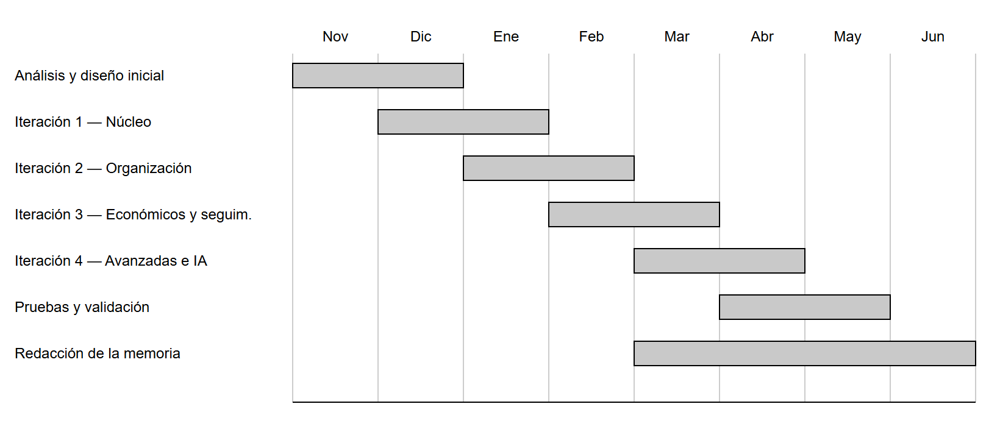

# 5. PLANIFICACIÓN Y ESTIMACIÓN DE COSTES

En este capítulo se describe la planificación temporal del proyecto y se realiza una
estimación de los costes asociados a su desarrollo. La planificación se apoya en la
metodología iterativa e incremental descrita en el capítulo 4, y la estimación de costes
distingue entre costes de personal, de software y de hardware.

## 5.1. Planificación temporal

El desarrollo se organizó en las iteraciones descritas en el capítulo anterior, a las que se
añaden una fase inicial de análisis y diseño, una fase de pruebas y validación y la
redacción de la memoria, que se desarrolló de forma solapada con las últimas iteraciones.
La Figura 5.1 presenta el diagrama de Gantt con la distribución temporal aproximada de
estas tareas a lo largo del curso académico.

**Figura 5.1.** Planificación temporal del proyecto (diagrama de Gantt). _Fuente:
elaboración propia._

Como se aprecia en la figura, las iteraciones se encadenan de forma que cada una comienza
antes de que finalice completamente la anterior, lo que refleja el carácter incremental del
desarrollo. Las pruebas y la redacción de la memoria se extienden sobre las fases finales,
en paralelo al último trabajo de implementación.

La Tabla 5.1 detalla las tareas en que se descompuso el proyecto, con su semana de inicio y
de fin —tomando como referencia la primera semana de noviembre como semana 1— y su duración
aproximada. El solapamiento entre tareas refleja el carácter incremental del desarrollo.

**Tabla 5.1.** Planificación de tareas por semanas.

| Tarea | Semana inicio | Semana fin | Duración |
|---|---|---|---|
| Análisis y diseño inicial | S1 | S4 | 4 semanas |
| Iteración 1 — Núcleo (autenticación y gestión de invitados) | S3 | S9 | 7 semanas |
| Iteración 2 — Organización (grupos, mesas, tareas y agenda) | S8 | S15 | 8 semanas |
| Iteración 3 — Económicos y seguimiento (presupuesto, proveedores y panel) | S14 | S21 | 8 semanas |
| Iteración 4 — Avanzadas e IA (invitaciones/RSVP, asistencias de IA y endurecimiento) | S20 | S28 | 9 semanas |
| Pruebas y validación | S26 | S32 | 7 semanas |
| Redacción de la memoria | S22 | S34 | 13 semanas |

Cada iteración se descompone internamente en las tareas de análisis, diseño, implementación
y prueba de los módulos que la componen, siguiendo el ciclo descrito en el capítulo 4. La
duración total del proyecto abarca aproximadamente treinta y cuatro semanas del curso
académico, entre noviembre y junio.

## 5.2. Estimación de costes

La estimación de costes se descompone en tres partidas: personal, software y hardware. Al
tratarse de un proyecto de fin de máster desarrollado por una sola persona, la partida más
relevante es la de personal.

### 5.2.1. Costes de personal

Se estima una dedicación aproximada de 600 horas de desarrollo, correspondientes a las
distintas iteraciones y a las fases de análisis, pruebas y documentación, a las que se
añade una dedicación menor en concepto de dirección y tutorización. La Tabla 5.2 recoge la
estimación, empleando tarifas de referencia del mercado.

**Tabla 5.2.** Estimación de costes de personal.

| Rol | Horas | Coste/hora | Total |
|---|---|---|---|
| Ingeniero de software (desarrollo) | 600 h | 20 €/h | 12.000 € |
| Dirección y tutorización | 25 h | 45 €/h | 1.125 € |
| **Total** | | | **13.125 €** |

### 5.2.2. Costes de software

Todas las herramientas de desarrollo empleadas son de código abierto, bajo licencias
permisivas (MIT, Apache 2.0, etc.), o servicios con un plan gratuito, por lo que su coste de
adquisición es nulo. El único coste reseñable corresponde al uso de la API de inteligencia
artificial, facturada por consumo. La Tabla 5.3 detalla cada herramienta, su licencia de uso
y su coste.

**Tabla 5.3.** Herramientas de software, licencia y coste.

| Herramienta | Licencia | Coste |
|---|---|---|
| Node.js, React, Express, Vite, Tailwind CSS, Zod, Vitest | MIT | 0 € |
| Prisma, Docker Engine | Apache 2.0 | 0 € |
| PostgreSQL | PostgreSQL License | 0 € |
| Git | GPL v2 | 0 € |
| Visual Studio Code | MIT | 0 € |
| GitHub (repositorio remoto) | SaaS, plan gratuito | 0 € |
| API de OpenAI (modelo `gpt-4o-mini`) | Comercial, pago por consumo | 5 € |
| **Total** | | **5 €** |

El coste de la **API de OpenAI** no corresponde a una suscripción de tarifa plana, sino a un
modelo de **pago por consumo** en función del número de *tokens* procesados. Con el modelo
empleado, `gpt-4o-mini`, el precio de referencia es de aproximadamente 0,15 $ por millón de
*tokens* de entrada y 0,60 $ por millón de *tokens* de salida. Durante el desarrollo se
realizaron numerosas pruebas de las tres asistencias (tareas, mesas y presupuesto), con un
consumo estimado del orden de varios millones de *tokens*, lo que se traduce en un coste
aproximado de 5 €.

### 5.2.3. Costes de hardware

El desarrollo se realizó sobre un único ordenador portátil. Su coste se imputa de forma
proporcional al tiempo de uso durante el proyecto, considerando una vida útil de cuatro
años. La Tabla 5.4 recoge esta estimación.

**Tabla 5.4.** Estimación de costes de hardware.

| Hardware | Coste | Amortización | Coste imputado |
|---|---|---|---|
| Ordenador portátil de desarrollo | 1.000 € | 8 meses de uso sobre 48 de vida útil | 167 € |
| **Total** | | | **167 €** |

### 5.2.4. Coste total

Sumando las tres partidas anteriores, la Tabla 5.5 presenta el coste total estimado del
proyecto.

**Tabla 5.5.** Coste total estimado del proyecto.

| Partida | Coste |
|---|---|
| Personal | 13.125 € |
| Software | 5 € |
| Hardware | 167 € |
| **Total** | **13.297 €** |

El coste está dominado por la partida de personal, como es habitual en un proyecto de
desarrollo software, mientras que el uso de tecnologías de código abierto mantiene los
costes de software y hardware en valores reducidos.
