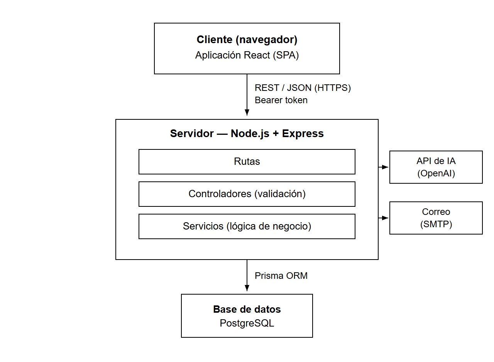
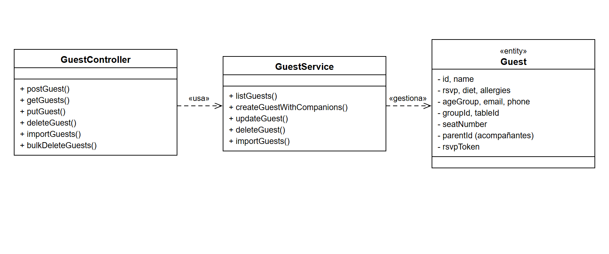
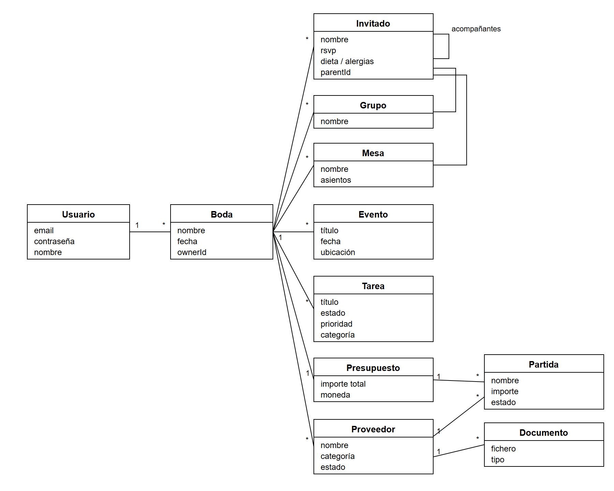
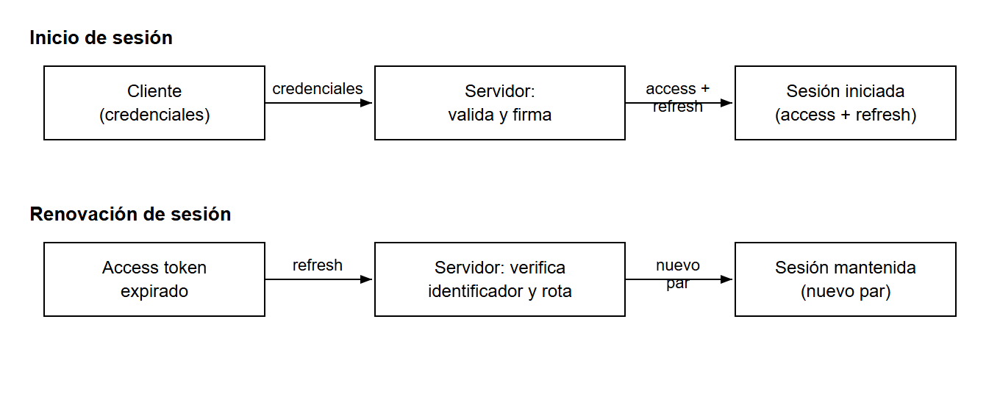

# 7. DISEÑO

Una vez definido *qué* debe hacer la aplicación (capítulo 6), este capítulo describe
*cómo* se ha construido: la arquitectura general del sistema, el modelo de datos que
sustenta la información, la forma en que el cliente y el servidor se comunican, los
mecanismos de autenticación y autorización, la estructura de navegación y, por último, el
diseño de la interfaz. El objetivo es dejar documentadas las decisiones de diseño y su
justificación, de modo que la implementación (capítulo 8) sea la traducción directa de lo
aquí planteado.

## 7.1. Arquitectura general

La aplicación sigue una **arquitectura cliente-servidor** de tres niveles: una interfaz
de usuario que se ejecuta en el navegador, un servidor que expone una API y contiene la
lógica de negocio, y una base de datos relacional que persiste la información. El código
se organiza en un único repositorio (*monorepo*) con **dos paquetes independientes** —
`frontend` y `backend` — que se despliegan y ejecutan por separado.

El **backend** se estructura en **capas por dominio**, con un módulo por cada entidad del
sistema (invitados, grupos, mesas, tareas, etc.). Cada petición atraviesa tres capas bien
diferenciadas:

- **Rutas** (`routes`): definen los puntos de acceso de la API y el verbo HTTP asociado.
- **Controladores** (`controllers`): son responsables de **toda la validación** de la
  entrada (parámetros, cuerpo y consulta) mediante esquemas, dan forma a la respuesta HTTP
  y delegan la lógica en la capa de servicio.
- **Servicios** (`services`): contienen la **lógica de negocio** y el acceso a la base de
  datos a través del ORM. Las operaciones que implican varias escrituras se resuelven en
  transacción.

Esta separación estricta —validación en el controlador, lógica en el servicio— favorece
la mantenibilidad y la capacidad de prueba (RNF-10), ya que cada capa tiene una única
responsabilidad y puede evolucionar o testearse de forma aislada.

El **frontend** es una **aplicación de página única** (SPA). Todas las llamadas de red se
canalizan a través de una **única capa de acceso a la API**, que centraliza la inclusión
del *token* de sesión, el control de expiración y el tratamiento de errores; sobre ella,
cada dominio dispone de un servicio propio que encapsula sus operaciones y los tipos y
etiquetas en español asociados.

La **persistencia** se resuelve con una base de datos **PostgreSQL** accedida mediante un
**ORM** que, a partir de un esquema declarativo, genera un cliente con tipado estático y
gestiona las migraciones. Por último, el servidor se integra con dos **servicios
externos**: un servicio de correo (SMTP) para el envío de invitaciones y la recuperación
de contraseña, y la API de inteligencia artificial para las asistencias descritas en el
capítulo 6. Ambas integraciones residen **exclusivamente en el backend**; el cliente nunca
maneja credenciales de estos servicios (IA-90).

La Figura 7.1 presenta la arquitectura general del sistema, con sus tres niveles y las integraciones externas.

**Figura 7.1.** Arquitectura general de la aplicación. _Fuente: elaboración propia._

El flujo por capas descrito puede visualizarse mediante un diagrama de clases. La Figura 7.2 lo ilustra para el módulo de invitados, representativo del resto de módulos: el controlador (GuestController) valida la entrada y delega en el servicio (GuestService), que contiene la lógica de negocio y gestiona la entidad de dominio (Guest). Todos los módulos del sistema siguen esta misma estructura.

**Figura 7.2.** Diagrama de clases del módulo de invitados, cuya estructura es común a todos los módulos. _Fuente: elaboración propia._

## 7.2. Modelo de datos

El modelo de datos es **relacional** y está **enraizado en el usuario**: un usuario posee
una o varias bodas, y toda la información del sistema (invitados, grupos, mesas, eventos,
tareas, presupuesto y proveedores) cuelga de una boda. Esta jerarquía es la que permite el
**aislamiento entre bodas**: cada entidad de dominio referencia la boda a la que pertenece,
lo que hace posible acotar cualquier consulta al propietario correspondiente (RNF-01).

Los **borrados se propagan en cascada** desde la boda hacia todas sus entidades hijas (y
desde el usuario hacia sus bodas), de modo que eliminar una boda deja el sistema en un
estado consistente sin registros huérfanos. La Figura 7.3 muestra las entidades
principales del dominio y sus relaciones.

**Figura 7.3.** Modelo de datos del dominio. _Fuente: elaboración propia._

Las principales entidades y decisiones de diseño son:

- **Usuario** y **Boda.** El usuario guarda sus credenciales (con la contraseña cifrada) y
  posee sus bodas. La boda almacena su nombre y fecha, y actúa como raíz del resto del
  modelo.
- **Invitado.** Es la entidad más rica. Además de sus datos (nombre, correo, teléfono,
  asistencia, dieta, alergias, grupo de edad, notas), incorpora una **relación reflexiva**:
  un invitado principal puede tener varios **acompañantes**, modelados como invitados que
  apuntan a su «padre». Referencia opcionalmente un grupo y una mesa con su número de
  asiento, y dispone de un **token único** para el enlace público de confirmación de
  asistencia.
- **Grupo** y **Mesa.** Agrupan invitados. La mesa define su número de asientos. Para
  garantizar que **un asiento no se asigne dos veces**, el modelo impone una **restricción
  de unicidad** sobre la pareja (mesa, número de asiento).
- **Evento** y **Tarea.** Modelan la agenda y el listado de tareas. La tarea utiliza
  **enumerados** para su prioridad, estado y categoría, lo que garantiza la integridad de
  esos valores a nivel de base de datos.
- **Presupuesto** y **partidas de gasto.** La boda tiene un presupuesto global (relación
  uno a uno) y un conjunto de partidas. Cada partida registra importes estimado, real y
  pagado, su estado y su categoría, y puede **vincularse opcionalmente a un proveedor**
  (con desvinculación automática si el proveedor se elimina), conservando además un campo
  de proveedor en texto libre como respaldo.
- **Proveedor** y **documentos.** El proveedor guarda categoría, estado de contratación,
  contacto y precios, y puede tener asociados varios **documentos** (contratos,
  presupuestos), de los que se almacenan sus metadatos.

De forma auxiliar, el modelo incluye dos tablas ligadas al usuario para la gestión segura
de la sesión —una para los **tokens de refresco** activos y otra para los **tokens de
recuperación de contraseña**— que se describen en §7.4 y no se representan en la Figura 7.3
por no pertenecer al dominio de la boda.

El uso de un **esquema declarativo** con generación automática del cliente aporta **tipado
estático de extremo a extremo** en el backend y un **sistema de migraciones** versionado,
lo que reduce los errores de acceso a datos y facilita la evolución del esquema.

## 7.3. Comunicación y API REST

La comunicación entre cliente y servidor se realiza mediante una **API REST** que
intercambia **JSON** sobre HTTP. Todos los puntos de acceso cuelgan del prefijo `/api` y,
salvo los públicos (salud, autenticación y confirmación de asistencia), exigen un *token*
de sesión en la cabecera `Authorization: Bearer`.

Los recursos se organizan por dominio y utilizan los verbos HTTP de forma convencional
(`GET` para consultar, `POST` para crear, `PUT`/`PATCH` para actualizar y `DELETE` para
eliminar). El **alcance por boda** se transmite como parámetro (`?weddingId=…` o en la
ruta), y el servidor acota cada operación a esa boda tras verificar su propiedad. La
Tabla 7.1 recoge una muestra representativa de la API.

**Tabla 7.1.** Muestra de puntos de acceso de la API.

| Verbo y ruta | Función |
|---|---|
| `POST /api/auth/register` · `/login` · `/refresh` · `/logout` | Alta, inicio de sesión, refresco y cierre de sesión |
| `GET/POST/PUT/DELETE /api/guests` | Gestión de invitados |
| `POST /api/guests/import` · `/guests/bulk-delete` | Importación y borrado masivo |
| `GET/POST/DELETE /api/tables` · `PUT /api/tables/:id/seats/:n/assign` | Mesas y asignación de asientos |
| `GET/POST/PUT/DELETE /api/tasks` · `/events` · `/budget/items` · `/providers` | Tareas, agenda, presupuesto y proveedores |
| `GET /api/dashboard` · `/notifications` | Panel de seguimiento y avisos |
| `GET/POST /api/public/rsvp/:token` | Confirmación pública de asistencia (sin sesión) |
| `POST /api/ai/tasks/suggest` · `/ai/seating/suggest` · `/ai/budget/suggest` | Asistencias con IA |

Un aspecto de diseño relevante es el **tratamiento uniforme de errores** (RNF-22). El
servidor dispone de un manejador central que convierte cualquier fallo en una respuesta
JSON homogénea con la forma `{ error }`: los errores de validación se devuelven como
**400** con un mensaje legible en español, los conflictos conocidos de la base de datos se
mapean a sus códigos HTTP (por ejemplo, un valor duplicado a **409** y un registro
inexistente a **404**), y cualquier error inesperado se enmascara como **500 genérico** sin
filtrar detalles internos en producción. En el cliente, la capa de acceso a la API extrae
ese campo `error` del cuerpo, de modo que los componentes muestran siempre un mensaje
limpio al usuario.

## 7.4. Autenticación y autorización

**Autenticación.** La sesión se basa en **JSON Web Tokens (JWT)** (Jones et al., 2015) con dos piezas: un
*token* de **acceso** de vida corta, que autoriza cada petición, y un *token* de
**refresco** de vida larga, que permite renovar el acceso sin volver a introducir las
credenciales. Cuando el acceso expira, el cliente solicita de forma transparente un nuevo
par de *tokens* mediante el *token* de refresco (RF-04), lo que evita que la expiración
del acceso expulse al usuario al inicio de sesión.

Para poder **invalidar sesiones de forma efectiva** (RF-05), cada *token* de refresco
lleva un identificador único que se **persiste** en la base de datos. Al renovar, el
servidor comprueba que ese identificador siga vigente y **rota** el par de *tokens*,
eliminando el anterior; de este modo un *token* de refresco antiguo deja de ser válido en
cuanto se usa uno nuevo. El cierre de sesión revoca el identificador presentado. La
**recuperación de contraseña** (RF-06) se apoya en un *token* de un solo uso del que se
guarda únicamente su **huella (hash)** con caducidad limitada; al restablecer la
contraseña, el *token* se consume y se revocan todas las sesiones activas del usuario.

La Figura 7.4 resume el flujo de acceso y renovación de sesión.

**Figura 7.4.** Flujo de autenticación y renovación de la sesión. _Fuente: elaboración
propia._

**Autorización.** El sistema no distingue roles ni permisos entre usuarios: la
autorización se basa por completo en la **propiedad de la boda** (RNF-01). Se aplica en dos
frentes complementarios. Para las operaciones con alcance de boda (listar, crear, importar,
acciones masivas), un **middleware** verifica que el `weddingId` de la petición pertenezca
al usuario del *token*, rechazando con **404** cualquier acceso ajeno para no revelar la
existencia del recurso. Para las operaciones sobre un recurso concreto (por identificador),
las consultas de servicio se **acotan por propietario**, cerrando así la posibilidad de
acceder a recursos de otra boda manipulando su identificador. Esta doble barrera fue una de
las decisiones de diseño más importantes del proyecto, al ser la base del aislamiento entre
bodas.

## 7.5. Estructura de navegación

La navegación del frontend se resuelve con un enrutador de cliente que distingue dos
grandes zonas:

- **Rutas públicas**, accesibles sin sesión: inicio de sesión, registro, recuperación y
  restablecimiento de contraseña, y la **página pública de confirmación de asistencia**
  (`/rsvp/:token`). Estas rutas usan una disposición mínima sin la estructura de la
  aplicación.
- **Rutas protegidas**, envueltas en un componente de guarda que exige sesión válida y en
  la **disposición principal** (cabecera con selector de boda, cuenta atrás, avisos y
  perfil; y menú lateral de navegación). De aquí cuelgan las páginas de los módulos: inicio
  (panel), invitados, tareas, agenda, presupuesto, proveedores y ajustes.

El **menú de navegación** se define en un único lugar y actúa como **fuente única de
verdad**, de la que se derivan tanto el menú lateral de escritorio como el menú desplegable
en móvil. De forma coherente, en el servidor las **rutas públicas se registran antes** que
las protegidas, ya que estas últimas montan la exigencia de sesión en su raíz e
interceptarían cualquier petición posterior; este orden fue necesario para que el enlace
público de confirmación de asistencia conviviera con el resto de la API.

## 7.6. Diseño de la interfaz

La interfaz se ha construido sobre un **sistema de diseño** basado en un framework de
utilidades CSS y una biblioteca de componentes accesibles, lo que garantiza coherencia
visual y comportamiento uniforme en todos los módulos. Los colores, la tipografía y los
espaciados se definen como **variables de diseño (tokens)**, lo que permite un **modo claro
y un modo oscuro** consistentes en toda la aplicación.

Se ha adoptado una **identidad visual de estilo editorial** acorde con la temática de una
boda: una paleta cálida, tipografía serif para los titulares y tarjetas de trazo fino. El
objetivo fue que la aplicación resultara clara y cuidada —coherente con la ilusión de
organizar una boda— sin sacrificar la claridad funcional.

El diseño se apoya en **componentes reutilizables** que unifican el comportamiento en toda
la aplicación: diálogos, tarjetas de métricas, formularios y, en particular, un **diálogo
de confirmación** común a todas las acciones destructivas y un sistema de **avisos
(toasts)** que informa del resultado de cada operación (RNF-23). Esta reutilización reduce
la duplicación y asegura que acciones equivalentes se comporten igual en cualquier pantalla.

La interfaz es **responsive** (RNF-20): en pantallas pequeñas, el menú lateral se oculta y
su contenido se ofrece a través de un panel deslizante accesible desde la cabecera, y las
tablas anchas incorporan desplazamiento horizontal. Toda la aplicación está **localizada en
español**, con formatos de fecha y moneda `es-ES`/EUR (RNF-21). Las capturas de las
distintas pantallas se presentan en el capítulo 8 (Implementación) y, de forma guiada, en
el Anexo B (Manual de usuario).
