# ANEXO B. MANUAL DE USUARIO

Este anexo describe, apoyándose en capturas de la aplicación, las principales acciones que
puede realizar el usuario. Las imágenes corresponden a una boda de demostración con datos
representativos.

## B.1. Registro e inicio de sesión

Al acceder a la aplicación, el usuario puede crear una cuenta desde la página de registro,
indicando su nombre, correo y contraseña. Si ya dispone de cuenta, inicia sesión con su
correo y contraseña. Al registrarse se crea automáticamente su primera boda.

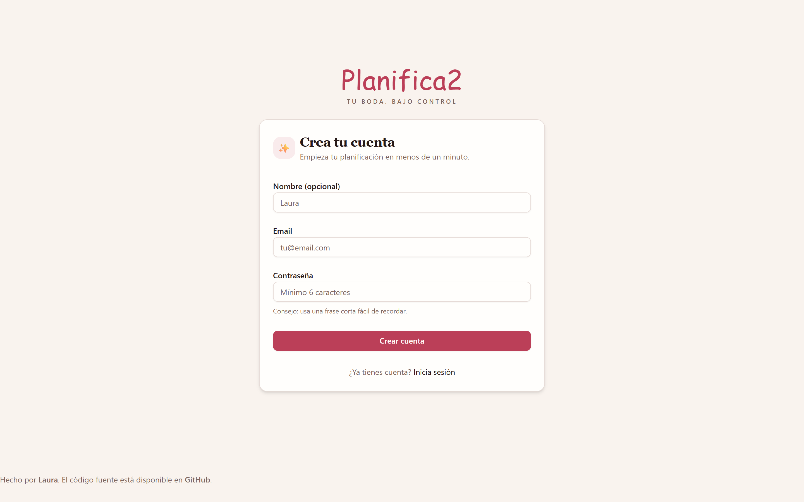

**Figura B.1.** Página de registro.

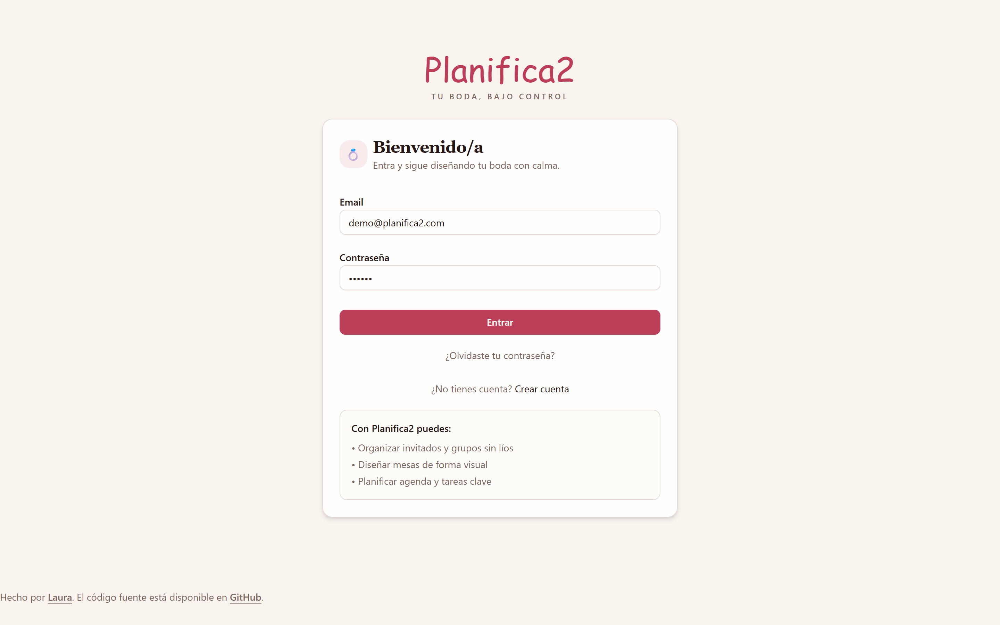

**Figura B.2.** Página de inicio de sesión.

## B.2. Panel de seguimiento

Tras iniciar sesión, el usuario accede al panel de seguimiento, que resume el estado de la
boda: invitaciones enviadas, proveedores, progreso de tareas, estado del presupuesto,
reparto de invitados por asistencia y próximas tareas. En la cabecera se muestran el selector
de boda, la cuenta atrás hasta la fecha del enlace y la campana de avisos.

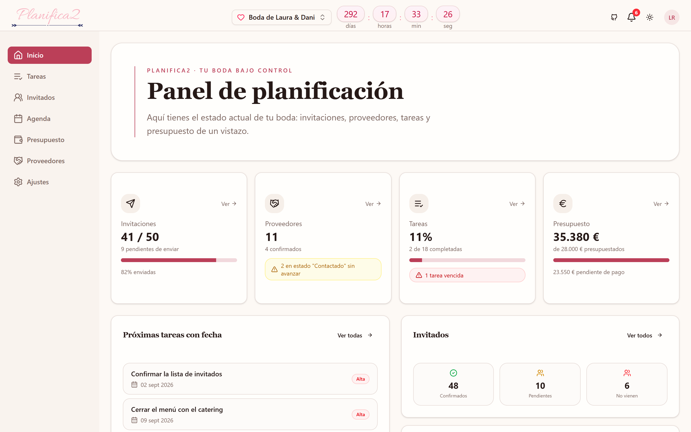

**Figura B.3.** Panel de seguimiento de la boda.

## B.3. Invitados

Desde la pestaña de invitados, el usuario da de alta a los invitados y sus acompañantes,
gestiona su estado de asistencia, sus datos y sus alergias, y controla el envío de
invitaciones. También puede importar y exportar la lista en formato CSV, y eliminar
invitados de forma individual o masiva.

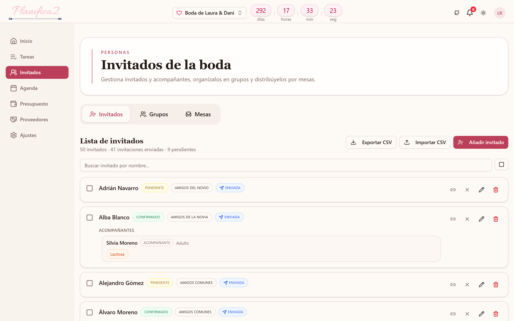

**Figura B.4.** Lista de invitados con acompañantes.

## B.4. Grupos

La pestaña de grupos permite organizar a los invitados en agrupaciones (familia, amigos,
compañeros de trabajo, etc.) y asignar invitados a cada grupo.

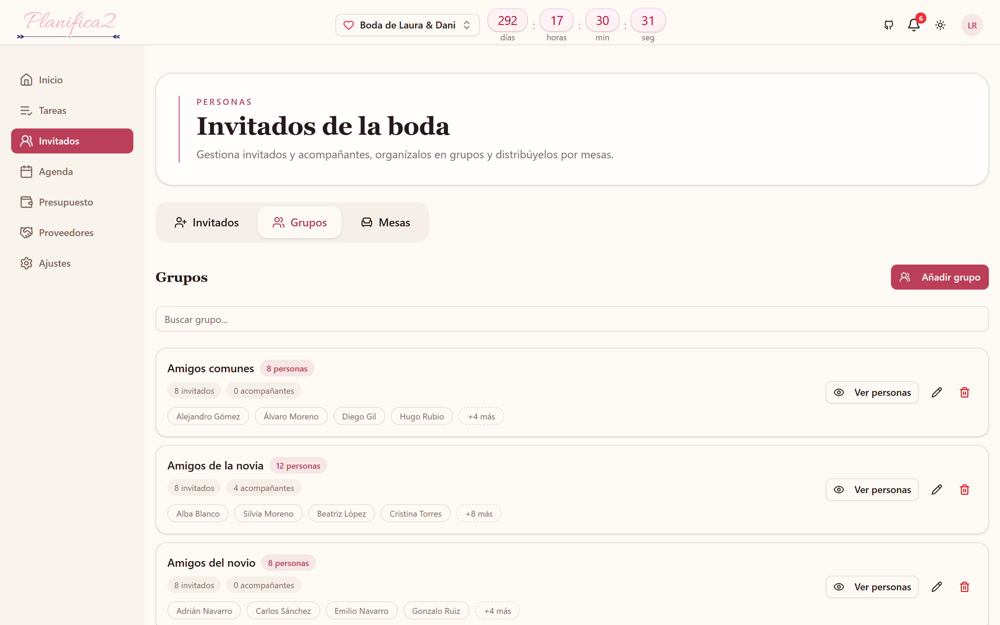

**Figura B.5.** Gestión de grupos de invitados.

## B.5. Mesas

En la pestaña de mesas, el usuario crea las mesas indicando su número de asientos y
distribuye a los invitados sobre un mapa visual: selecciona a una persona y la coloca en un
asiento libre. Cada mesa muestra su ocupación, y es posible liberar un asiento o vaciar una
mesa. Desde aquí puede además solicitarse una distribución automática con inteligencia
artificial.

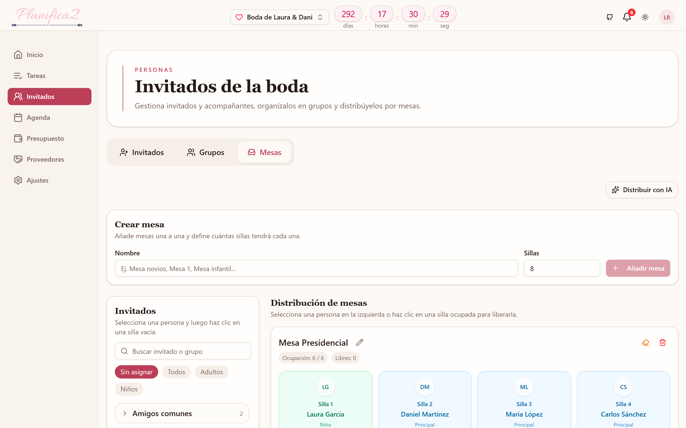

**Figura B.6.** Distribución de invitados en las mesas.

## B.6. Tareas

La sección de tareas permite gestionar el listado de cosas por hacer, cada una con su
prioridad, estado, categoría y fecha límite, con filtros para localizarlas rápidamente.

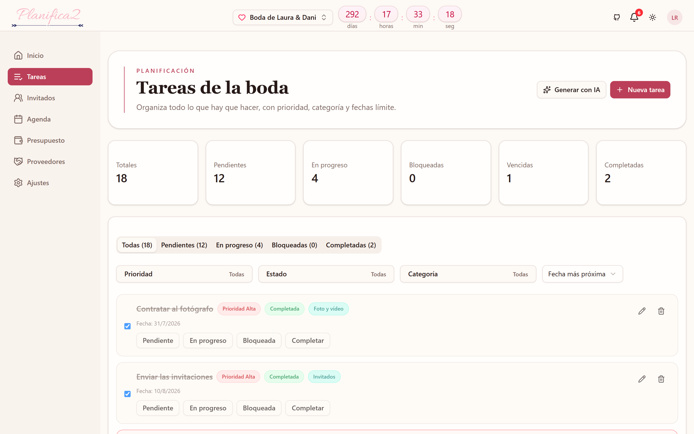

**Figura B.7.** Gestión de tareas.

## B.7. Agenda

La agenda muestra los eventos de la boda (reuniones, pruebas, ceremonia, banquete) en una
vista de calendario.

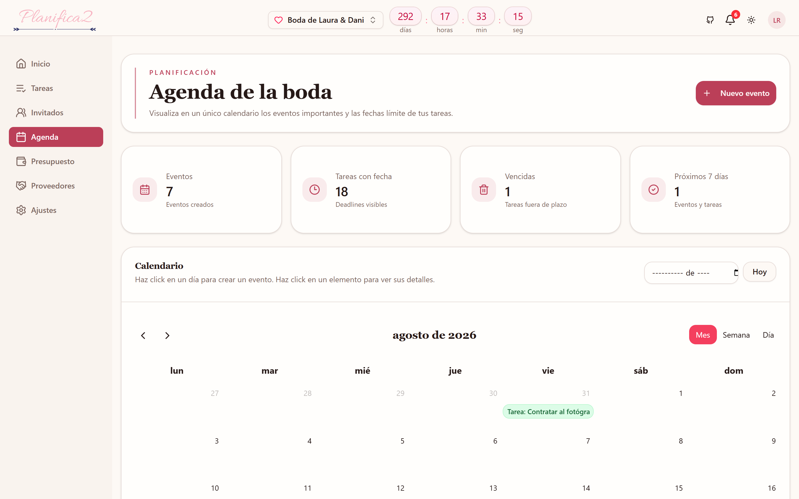

**Figura B.8.** Agenda de eventos.

## B.8. Presupuesto

La sección de presupuesto permite definir el importe global y gestionar las partidas de
gasto, con su estado y sus pagos, y visualizar el reparto y el seguimiento mediante gráficas.

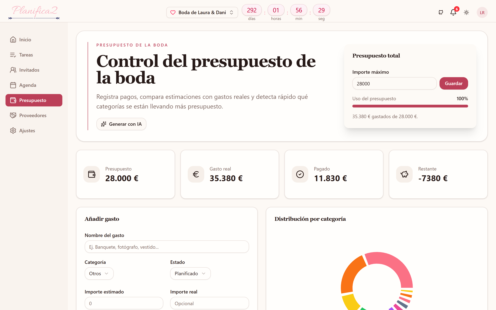

**Figura B.9.** Gestión del presupuesto.

## B.9. Proveedores

Desde la sección de proveedores, el usuario gestiona los proveedores de la boda con su
categoría, estado de contratación, datos de contacto y precios, y puede adjuntar documentos
a cada uno.

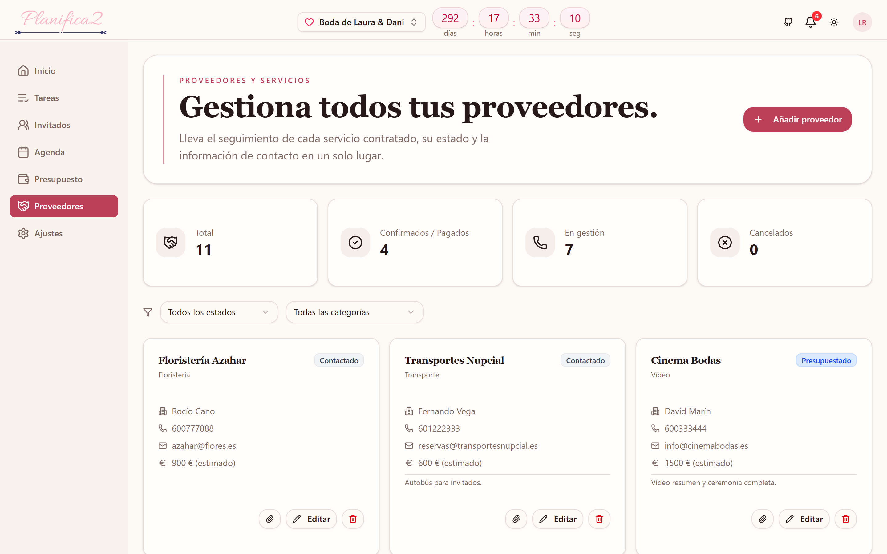

**Figura B.10.** Gestión de proveedores.

## B.10. Ajustes

En la sección de ajustes, el usuario edita los datos de la boda (nombre y fecha) y de su
perfil, y puede cambiar su contraseña.

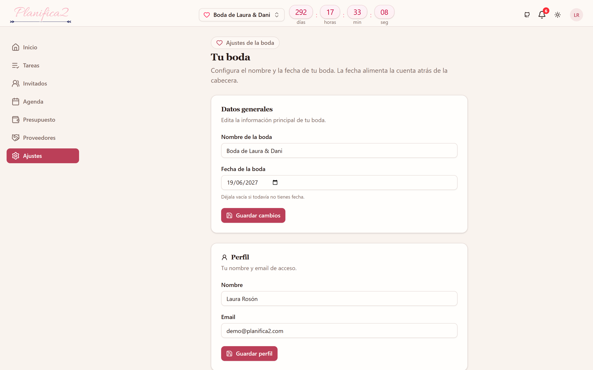

**Figura B.11.** Ajustes de la boda y del perfil.

## B.11. Asistencias con inteligencia artificial

En las secciones de tareas, mesas y presupuesto, el usuario puede solicitar una propuesta
generada por inteligencia artificial. El sistema muestra las propuestas en un diálogo donde
el usuario revisa, desmarca lo que no desee y confirma; nada se guarda hasta esa
confirmación.

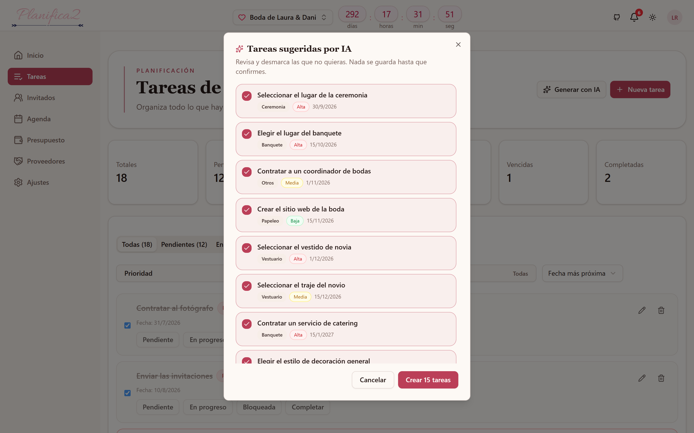

**Figura B.12.** Propuesta de tareas generada por inteligencia artificial.
